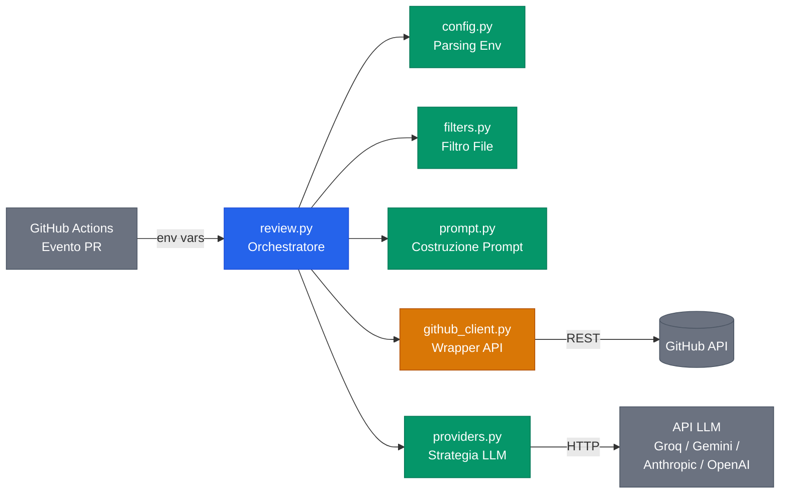
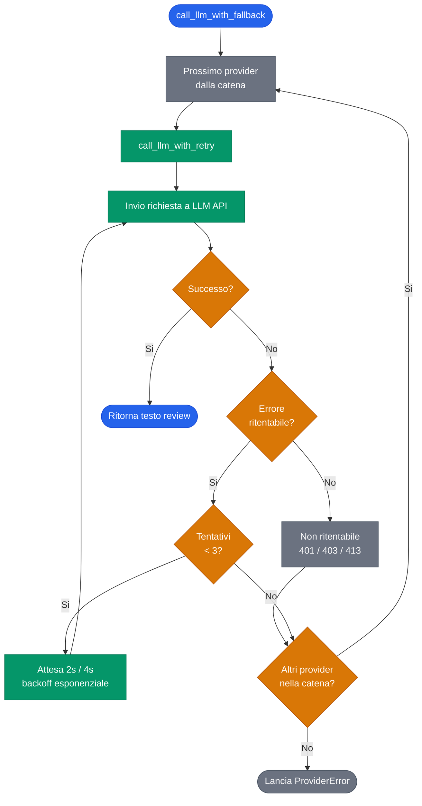

# AI PR Reviewer

[](https://github.com/AndreaBonn/ai-pr-reviewer)
[](LICENSE)

**Italiano** | [English](README.md)

Una GitHub Action che analizza automaticamente le Pull Request tramite un LLM e pubblica una code review strutturata come commento sulla PR. Supporta **Groq**, **Gemini**, **Anthropic** e **OpenAI**, con fallback automatico tra provider.

---

## Architettura



---

## Avvio Rapido

### 1. Aggiungi la API key come secret del repository

Vai su **Settings → Secrets and variables → Actions** e crea un secret per il provider scelto (es. `GROQ_API_KEY`).

### 2. Crea il file workflow

Aggiungi `.github/workflows/ai-review.yml` al tuo repository:

```yaml
name: AI PR Review

on:
  pull_request:
    types: [opened, synchronize, reopened]

jobs:
  review:
    runs-on: ubuntu-latest
    permissions:
      contents: read
      pull-requests: write
    steps:
      - uses: actions/checkout@v4
      - uses: AndreaBonn/ai-pr-reviewer@v1
        with:
          llm_provider: 'groq'
          llm_api_key: ${{ secrets.GROQ_API_KEY }}
          github_token: ${{ secrets.GITHUB_TOKEN }}
          language: 'italian'
```

### 3. Apri una Pull Request

L'action pubblica un commento di review sulla PR. Pushando nuovi commit, il commento esistente viene aggiornato senza crearne un duplicato.

---

## Input

| Input | Obbligatorio | Default | Descrizione |
|-------|:------------:|---------|-------------|
| `llm_provider` | No | `groq` | Provider LLM, separati da virgola per il fallback (es. `groq,gemini`) |
| `llm_api_key` | **Si** | — | API key, separate da virgola, una per ogni provider |
| `llm_model` | No | Default del provider | Override del modello (es. `llama-3.1-8b`, `gpt-4o`) |
| `github_token` | **Si** | — | Token GitHub per pubblicare i commenti |
| `language` | No | `english` | Lingua della review: `english`, `italian`, `french`, `spanish`, `german` |
| `max_files` | No | `20` | Numero massimo di file da analizzare |
| `ignore_patterns` | No | `*.lock,*.min.js,...` | Pattern glob da ignorare, separati da virgola |

---

## Provider Supportati

| Provider | Costo | Modello Default | Velocità | Qualità |
|----------|-------|-----------------|----------|---------|
| Groq | Gratis | `llama-3.3-70b-versatile` | Veloce | Buona |
| Gemini | Gratis | `gemini-2.0-flash` | Media | Buona |
| Anthropic | A pagamento | `claude-sonnet-4-5` | Media | Migliore |
| OpenAI | A pagamento | `gpt-4o-mini` | Media | Buona |

### Ottenere le API Key

- **Groq** (gratis): [console.groq.com](https://console.groq.com)
- **Gemini** (gratis): [aistudio.google.com](https://aistudio.google.com)
- **Anthropic** (a pagamento): [console.anthropic.com](https://console.anthropic.com)
- **OpenAI** (a pagamento): [platform.openai.com](https://platform.openai.com)

---

## Fallback tra Provider

Se un provider fallisce (rate limit, downtime), l'action prova automaticamente il successivo nella lista. Ogni provider ha il proprio ciclo di retry prima del fallback.



### Multi-provider

```yaml
llm_provider: 'groq,gemini'
llm_api_key: '${{ secrets.GROQ_API_KEY }},${{ secrets.GEMINI_API_KEY }}'
```

### Multi-chiave (stesso provider)

Usa più API key per lo stesso provider per aggirare i limiti di rate per singola chiave:

```yaml
llm_provider: 'groq,groq,gemini'
llm_api_key: '${{ secrets.GROQ_KEY_1 }},${{ secrets.GROQ_KEY_2 }},${{ secrets.GEMINI_API_KEY }}'
```

L'override di `llm_model` si applica solo al primo provider. I provider di fallback usano il loro modello di default.

---

## Struttura della Review

La review generata copre:

| Sezione | Cosa verifica |
|---------|---------------|
| **Summary** | Valutazione complessiva della PR |
| **Bugs & Logic Issues** | Bug verificati, errori logici, edge case non gestiti |
| **Security** | Secret esposti, injection, deserializzazione non sicura |
| **Performance & Scalability** | Query N+1, I/O bloccante, paginazione mancante |
| **Breaking Changes** | API pubbliche rimosse/rinominate, tipi di ritorno modificati |
| **Testing Gaps** | Scenari specifici non testati nel codice nuovo/modificato |
| **What's Done Well** | Aspetti positivi |

---

## Esempio di Output

Quando l'action viene eseguita, un commento come questo appare sulla PR:


---

## Configurazione

### Secret del Repository

| Secret | Quando serve |
|--------|-------------|
| `GROQ_API_KEY` | Se usi Groq |
| `GEMINI_API_KEY` | Se usi Gemini |
| `ANTHROPIC_API_KEY` | Se usi Anthropic |
| `OPENAI_API_KEY` | Se usi OpenAI |

`GITHUB_TOKEN` è disponibile automaticamente, non serve configurarlo.

Per configurazioni multi-chiave, nomina i secret liberamente (es. `GROQ_KEY_1`, `GROQ_KEY_2`) e referenziali in ordine in `llm_api_key`.

### Permessi

Il workflow richiede questi permessi:

```yaml
permissions:
  contents: read
  pull-requests: write
```

Oppure abilita globalmente: **Settings → Actions → General → Workflow permissions → Read and write permissions**.

---

## Privacy e Sicurezza

Questa action invia titoli, descrizioni e diff delle PR al provider LLM configurato. Nessun dato viene memorizzato o raccolto da questa action. Nessuna credenziale o secret viene inclusa nel prompt. Consulta la privacy policy del tuo provider LLM per dettagli su come gestisce i dati inviati.

Consulta [SECURITY.it.md](SECURITY.it.md) per tutti i dettagli sulle misure di sicurezza implementate.

---

## Limitazioni

- Le review sono generate dall'AI e possono contenere imprecisioni — verifica sempre i suggerimenti prima di applicarli
- Questa action esegue solo analisi statica — non esegue codice e non lancia test
- Diff molto grandi (>100 file) sono limitate a `max_files` per evitare limiti di token
- Le patch dei singoli file sono troncate a 200 righe
- La qualità delle review dipende dal provider LLM e dal modello scelto
- I file binari vengono automaticamente ignorati

Hai trovato un problema? [Segnalalo qui](https://github.com/AndreaBonn/ai-pr-reviewer/issues).

---

## Supporto

Se questa action ti è utile, considera di lasciare una [stella su GitHub](https://github.com/AndreaBonn/ai-pr-reviewer).

## Licenza

Apache License 2.0 — vedi [LICENSE](LICENSE) e [NOTICE](NOTICE) per i dettagli.
