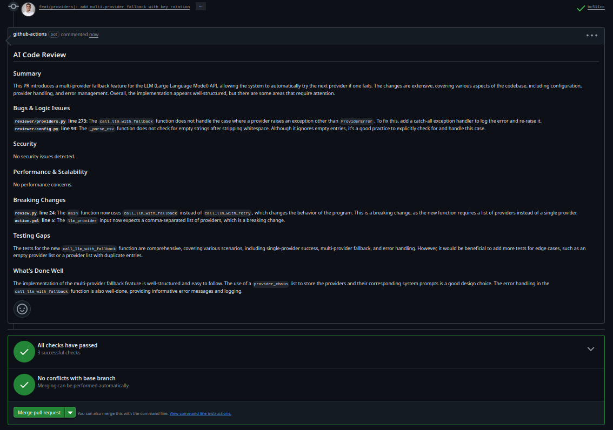

<div align="center">

# AI PR Reviewer

[](https://github.com/AndreaBonn/ai-pr-reviewer/actions/workflows/test.yml)
[](https://github.com/AndreaBonn/ai-pr-reviewer/actions/workflows/test.yml)
[](https://github.com/AndreaBonn/ai-pr-reviewer/actions/workflows/test.yml)
[](https://github.com/astral-sh/ruff)
[](LICENSE)
[](SECURITY.md)
[](https://github.com/AndreaBonn/ai-pr-reviewer)

</div>

[Italiano](README.it.md) | **English**

A GitHub Action that automatically reviews Pull Requests using an LLM and posts a structured code review as a PR comment. Supports **Groq**, **Gemini**, **Anthropic** and **OpenAI**, with automatic fallback between providers.

---

## Quick Start

### 1. Add your API key as a repository secret

Go to **Settings → Secrets and variables → Actions** and create a secret for your chosen provider (e.g. `GROQ_API_KEY`).

### 2. Create the workflow file

Add `.github/workflows/ai-review.yml` to your repository:

```yaml
name: AI PR Review

on:
  pull_request:
    types: [opened, synchronize, reopened]

jobs:
  review:
    runs-on: ubuntu-latest
    permissions:
      contents: read
      pull-requests: write
    steps:
      - uses: actions/checkout@v4
      - uses: AndreaBonn/ai-pr-reviewer@v1
        with:
          llm_provider: 'groq'
          llm_api_key: ${{ secrets.GROQ_API_KEY }}
          github_token: ${{ secrets.GITHUB_TOKEN }}
```

### 3. Open a Pull Request

The action posts a review comment on the PR. Pushing new commits updates the existing comment instead of creating a duplicate.

---

## Inputs

| Input | Required | Default | Description |
|-------|----------|---------|-------------|
| `llm_provider` | No | `groq` | LLM provider(s), comma-separated for fallback (e.g. `groq,gemini`) |
| `llm_api_key` | **Yes** | — | API key(s), comma-separated, one per provider entry |
| `llm_model` | No | Provider default | Override default model (e.g. `llama-3.1-8b`, `gpt-4o`) |
| `github_token` | **Yes** | — | GitHub token for posting comments |
| `language` | No | `english` | Review language: `english`, `italian`, `french`, `spanish`, `german` |
| `max_files` | No | `20` | Max files to review (avoids token limits) |
| `ignore_patterns` | No | `*.lock,*.min.js,...` | Comma-separated glob patterns to skip |

---

## Supported Providers

| Provider | Cost | Default Model | Speed | Quality |
|----------|------|---------------|-------|---------|
| Groq | Free | `llama-3.3-70b-versatile` | Fast | Good |
| Gemini | Free | `gemini-2.0-flash` | Medium | Good |
| Anthropic | Paid | `claude-sonnet-4-5` | Medium | Best |
| OpenAI | Paid | `gpt-4o-mini` | Medium | Good |

### Getting API Keys

- **Groq** (free): [console.groq.com](https://console.groq.com)
- **Gemini** (free): [aistudio.google.com](https://aistudio.google.com)
- **Anthropic** (paid): [console.anthropic.com](https://console.anthropic.com)
- **OpenAI** (paid): [platform.openai.com](https://platform.openai.com)

---

## Provider Fallback

If a provider fails (rate limit, downtime), the action automatically tries the next one in the list. Each provider gets its own retry cycle before falling back.

### Multi-provider

```yaml
llm_provider: 'groq,gemini'
llm_api_key: '${{ secrets.GROQ_API_KEY }},${{ secrets.GEMINI_API_KEY }}'
```

### Multi-key (same provider)

Use multiple API keys for the same provider to work around per-key rate limits:

```yaml
llm_provider: 'groq,groq,gemini'
llm_api_key: '${{ secrets.GROQ_KEY_1 }},${{ secrets.GROQ_KEY_2 }},${{ secrets.GEMINI_API_KEY }}'
```

The `llm_model` override applies only to the first provider. Fallback providers use their default model.

---

## Review Structure

The generated review covers:

| Section | What it checks |
|---------|---------------|
| **Summary** | Overall assessment of the PR |
| **Bugs & Logic Issues** | Verified bugs, logic errors, unhandled edge cases |
| **Security** | Secrets, injection, unsafe deserialization, auth gaps |
| **Performance & Scalability** | N+1 queries, blocking I/O, missing pagination |
| **Breaking Changes** | Removed/renamed public APIs, changed return types |
| **Testing Gaps** | Specific untested scenarios in new/changed logic |
| **What's Done Well** | Positive highlights |

---

## Example Output

When the action runs, a comment like this appears on your PR:



---

## Setup

### Repository Secrets

| Secret | When needed |
|--------|------------|
| `GROQ_API_KEY` | If using Groq |
| `GEMINI_API_KEY` | If using Gemini |
| `ANTHROPIC_API_KEY` | If using Anthropic |
| `OPENAI_API_KEY` | If using OpenAI |

`GITHUB_TOKEN` is automatically available — no configuration needed.

For multi-key setups, name the secrets freely (e.g. `GROQ_KEY_1`, `GROQ_KEY_2`) and reference them in order in `llm_api_key`.

### Permissions

The workflow needs these permissions:

```yaml
permissions:
  contents: read
  pull-requests: write
```

Or enable globally: **Settings → Actions → General → Workflow permissions → Read and write permissions**.

---

## Privacy & Security

This action sends PR titles, descriptions, and file diffs to the configured LLM provider. No data is stored or collected by this action. No credentials or secrets are included in the prompt. Review your LLM provider's privacy policy for details on how they handle submitted data.

See [SECURITY.md](SECURITY.md) for full details on the security measures implemented.

---

## Limitations

- Reviews are AI-generated and may contain inaccuracies — always verify suggestions before applying
- This action performs static analysis only — it does not execute code or run tests
- Very large diffs (>100 files) are capped at `max_files` to avoid token limits
- Individual file patches are truncated to 200 lines
- Quality of reviews depends on the chosen LLM provider and model
- Binary files are automatically skipped

Found an issue? [Report it here](https://github.com/AndreaBonn/ai-pr-reviewer/issues).

---

## Support

If this action is useful to you, consider giving it a [star on GitHub](https://github.com/AndreaBonn/ai-pr-reviewer).

## License

Apache License 2.0 — see [LICENSE](LICENSE) and [NOTICE](NOTICE) for details.
