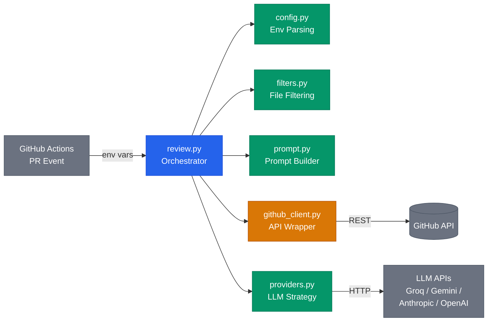
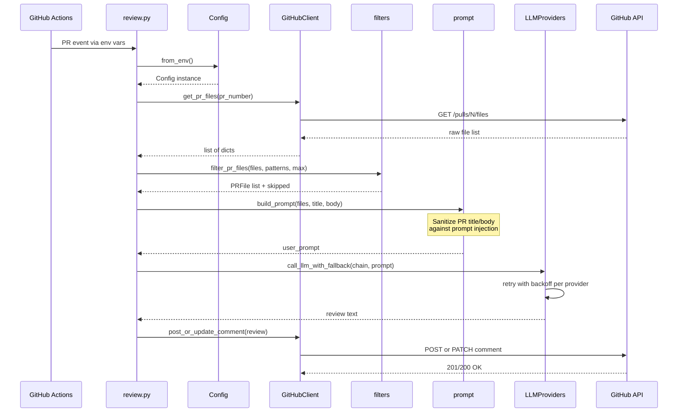
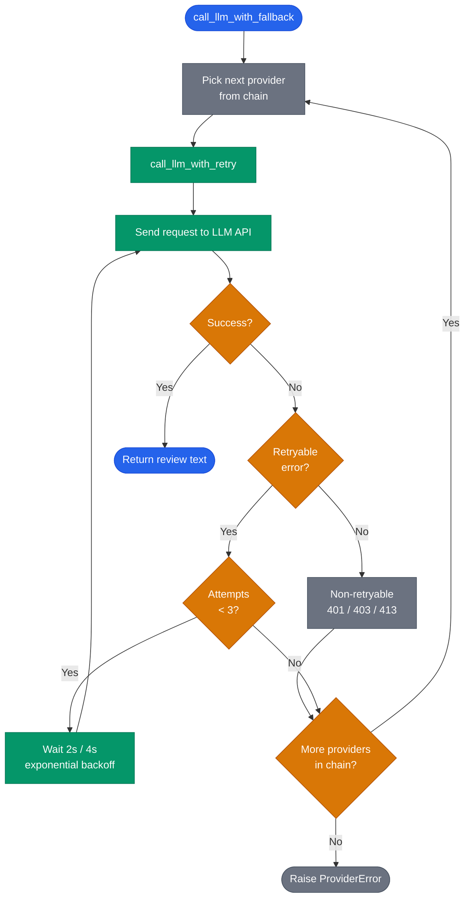

# Architecture

Technical documentation for the ai-pr-reviewer internal architecture.

## Component Overview

The system is composed of 6 Python modules orchestrated by `review.py`. External dependencies are GitHub API (for fetching PR data and posting comments) and LLM provider APIs (for generating the review).

**Legend:** Blue = orchestrator, Green = internal modules, Orange = data access, Grey = external systems.

## Review Pipeline

End-to-end flow from PR event to posted comment. Each step is a distinct responsibility handled by a dedicated module.

Key points:
- `Config.from_env()` validates all environment variables upfront; invalid config fails fast with `ConfigError`
- `filter_pr_files` removes ignored patterns, sorts by change size, caps at `max_files`, and truncates patches to 200 lines
- `build_prompt` sanitizes user-provided PR title/body against prompt injection before embedding them
- `post_or_update_comment` implements an upsert pattern: searches for an existing bot comment marker and updates it, or creates a new one

## Provider Fallback and Retry

The retry/fallback logic is the core resilience mechanism. Each provider gets up to 3 attempts with exponential backoff before the system falls back to the next provider in the chain.

Non-retryable HTTP status codes (401 Unauthorized, 403 Forbidden, 413 Payload Too Large) skip the retry loop entirely and proceed to the next provider. All other errors (timeouts, 429 rate limits, 5xx) trigger exponential backoff retries.
